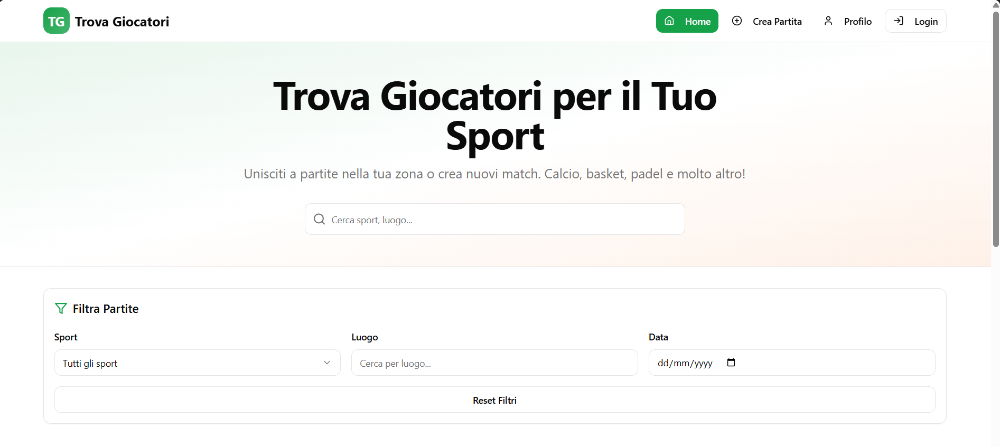

  

# ⚽ Trova Giocatori

**Trova Giocatori** (Italian for *Find Players*) is a modern web app that helps people create and join local sports matches — football, basketball, volleyball, padel, tennis, and more.

It’s designed for communities, friends, and casual players who want to organize games quickly and easily, without endless group chats or confusion.

---

## 🏀 Main Features

### ✅ Match Announcements
Users can create a game ad including:
- Sport type  
- Location / field  
- Date and time  
- Number of players needed / missing  
- Optional notes  

### 🗓 View and Filter Matches
- Browse all available matches  
- Filter by **sport**, **location**, or **date**

### 🙌 Join a Game
- Click **“Join”** to participate  
- Automatic management of player slots and waiting list  

### 💬 In-App Chat
- Each match has a simple internal chat  
- Coordinate with other players or confirm attendance  

### 👤 User Dashboard
- View matches you’ve **created** or **joined**  
- Manage participation easily  

### 🔔 Push Notifications *(via Firebase Cloud Messaging)*
- Alerts when:
  - Someone joins your game  
  - A new message is posted in the chat  
  - The game is approaching  

### 🗓 Calendar Integration
- Add games directly to **Google Calendar** or **Apple Calendar** with one click  

### 🧍 User Profiles
- Minimal player profile with:
  - Photo  
  - Name  
  - Favorite sports  

### ⭐ Player Reviews & Reputation
- Rate other players (1–5) for reliability and attendance  
- Helps reduce no-shows  

### 👥 Friends & Groups
- Follow other players  
- Create local clubs (e.g. “Neighborhood Team”)  

### ⚡ Last-Minute Mode
- Highlight last-minute games with push notifications for nearby users  

---

## 💻 Tech Stack

Built with:

- ⚡ [Vite](https://vitejs.dev/)
- ⚛️ [React](https://react.dev/)
- 🧠 [TypeScript](https://www.typescriptlang.org/)
- 🎨 [Tailwind CSS](https://tailwindcss.com/)
- 🧩 [shadcn/ui](https://ui.shadcn.com/)

---

## 🚀 Current Status (MVP)

### ✅ Implemented (working locally)
- Create and view matches  
- Filters by sport, location, and date  
- Join matches and manage participants  
- User dashboard (your matches)  
- Local chat (stored in browser)  
- Player slots and waiting list  
- Basic user profiles  

### ❌ Missing (requires backend)
- Real authentication (currently demo-only)  
- Persistent database (data saved only in localStorage)  
- Real-time chat (messages not shared between users)  
- Push notifications  
- Calendar integration (Google / Apple)  
- Player ratings and reputation system  
- Friends and groups  
- “Last minute” mode with geolocation alerts  

> 🔧 The current version is **fully functional UI-wise**, but **single-user only**.  
> The backend will be connected in the next development phase.

---

## 🧭 Roadmap

1. Connect backend for persistence  
2. Implement Firebase push notifications  
3. Enable real authentication and user sessions  
4. Add real-time chat with WebSockets  
5. Integrate Google/Apple Calendar  
6. Add reviews, friends, and group features  

# Start the development server
npm run dev
